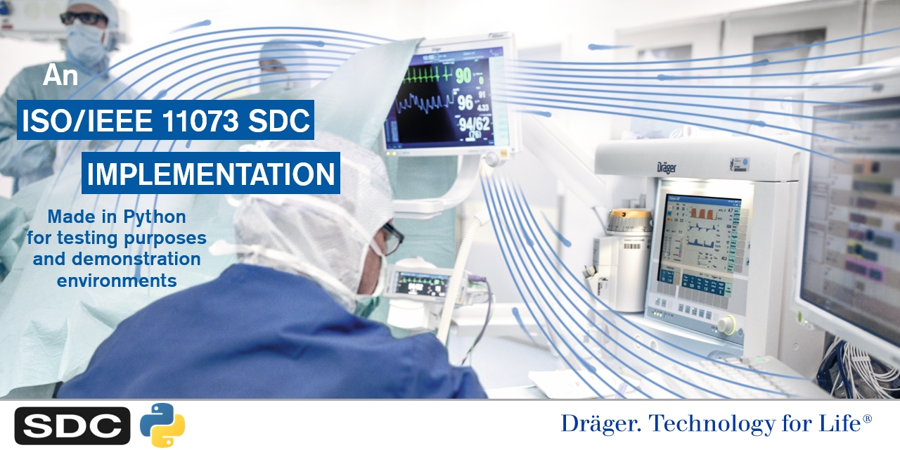

********
sdc11073
********

|img1| |img2| |img3| |img4| |img5|

.. |img1| image:: https://img.shields.io/pypi/pyversions/sdc11073
   :alt: pypi python version(s)

.. |img2| image:: https://img.shields.io/pypi/v/sdc11073
   :alt: pypi latest version

.. |img3| image:: https://img.shields.io/pypi/dm/sdc11073
   :alt: pypi downloads per month

.. |img4| image:: https://img.shields.io/badge/runs%20on-ubuntu%20%7C%20windows-blue
   :alt: runs on which operating systems

.. |img5| image:: https://codecov.io/gh/Draegerwerk/sdc11073/branch/v1.1.x/graph/badge.svg?token=EPLCCZMWMM
   :target: https://codecov.io/gh/Draegerwerk/sdc11073
   :alt: test coverage

Overview
========

ISO/IEEE 11073 is a standards family for the communication of medical devices. SDC
(Service-Oriented Device Connectivity) is one of the latest additions to
this family and is `described here <https://en.wikipedia.org/wiki/IEEE_11073_service-oriented_device_connectivity>`__.

Market-oriented information on SDC from Dräger can be found `here <https://www.draeger.com/Library/Content/sdc-information-sheet-9107546-en.pdf>`__.

SDC is supported by the interoperability association `OR.Net <https://ornet.org/en>`__.

Getting Started
===============

Installation
------------

Install `sdc11073 <https://pypi.org/project/sdc11073/>`__ from pypi using::

    pip install sdc11073

Install lz4 compression with::

    pip install sdc11073[lz4]

The latest development version can be installed via::

    git clone https://github.com/Draegerwerk/sdc11073/
    pip install .

you may use :code:`pip install -e .` for an `editable install <https://pip.pypa.io/en/stable/topics/local-project-installs/#editable-installs>`__.

Tutorials
---------

Tutorials can be found in the `tutorial <tutorial/>`__ folder

Tests
=====

Test can be executed with::

    git clone https://github.com/Draegerwerk/sdc11073/
    pip install ".[test]"
    pytest

Notices
=======

The sdc11073 python library is not intended for use in medical products, clinical trials, clinical studies, or in clinical routine.

ISO 9001
--------

The sdc11073 python library was not developed according to ISO 9001.

Support
=======

Issues can be filed `here <https://github.com/Draegerwerk/sdc11073/issues>`__.

License
=======

See LICENSE file
